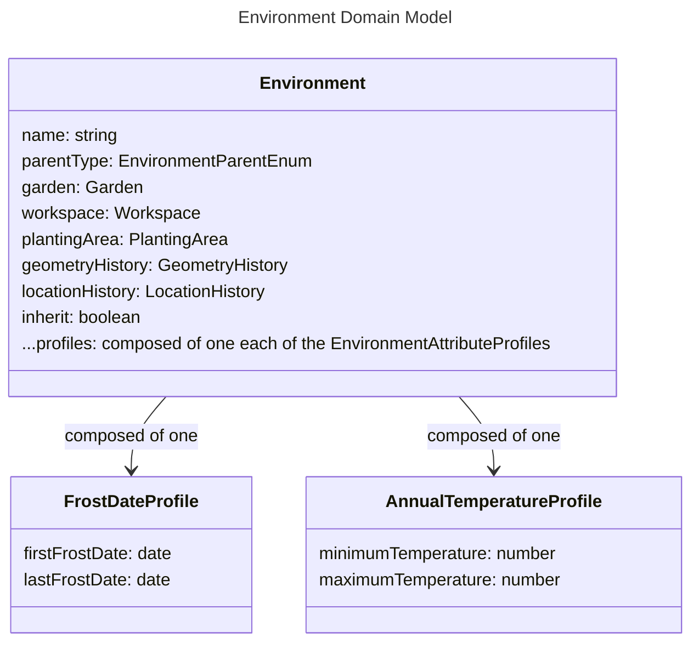

# Planner Models

# Environment

An Environment is a container for environmental characteristics, as well as the model which inputs about the world, such as temperature, can be connected to. An environment can be connected to a parent entity, where the Environment will apply across that entity, or it may define its own geometry.

## parentType, garden, workspace, plantingArea, geometryHistory, locationHistory, and inherit

An Environment may be connected to a parent entity. The value of `parentType` defines which it is connected to, and has the following options:

- garden: the environment applies to a garden
- workspace: the environment applies to a workspace
- plantingArea: the environment applies to a planting area
- independent: the environment applies to a geometry it defines

If `parentType` is independent, the geometryHistory and locationHistory attributes are defined. Otherwise, the values of `garden`, `workspace`, or `plantingArea` are defined depending on the value of `parentType`.

Only one Environment is allowed per parent. For example, you cannot define more than one Environment that applies to the same Workspace.

Environments are inherited based on a hierarchy. An environment is created which applies to the Garden by default. Everywhere in the garden inherits these characteristics. Then, if further specification is required, an Environment may be created which applied to a Workspace, which inherits its characteristics from the overarching Garden environment, but may override them. If the `inherit` attribute is set to false, a child Environment will not inherit any characteristics.

## profiles

Gardens should be able to define attributes of the physical environment.

### FrostDateProfile

Frost dates are a widely used heuristic for constructing planting calendars. The `FrostDatePlantingWindowProfile` defined in the Plants feature category use these to define acceptable planting windows.

- lastFrostDate: The date at which the last frost date is expected to occurr.
- firstFrostDate: The date at which the last frost date is expected to oc[urr.

### AnnualTemperatureProfile

Stores the expected minimum and maximum temperatures that may happen over the course of a year.

- minimumTemperature: The minimum temperature expected over the year.
- maximumTemperature: The maximum temperature expected over the year.
