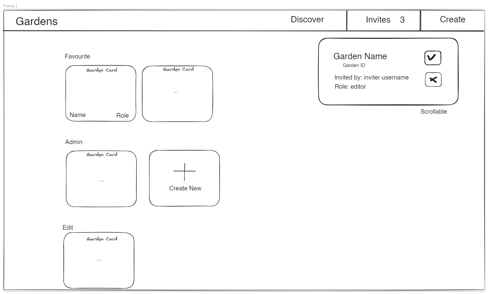
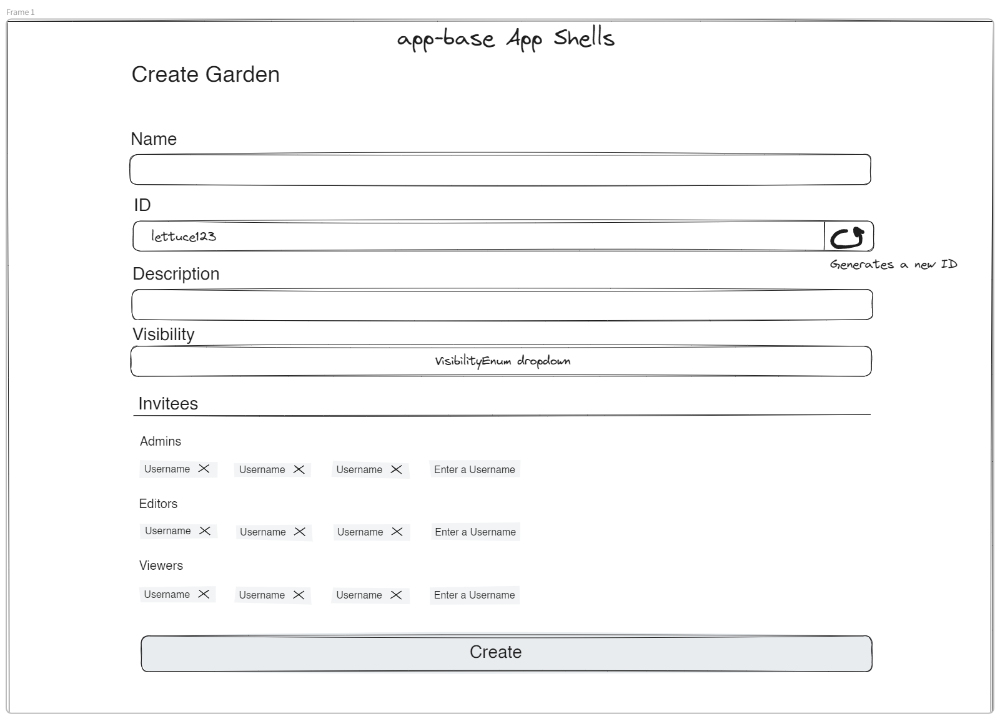
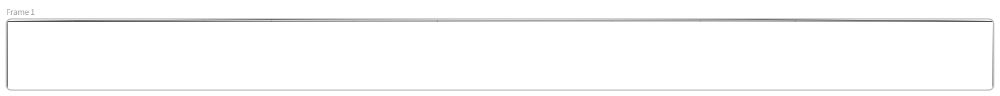
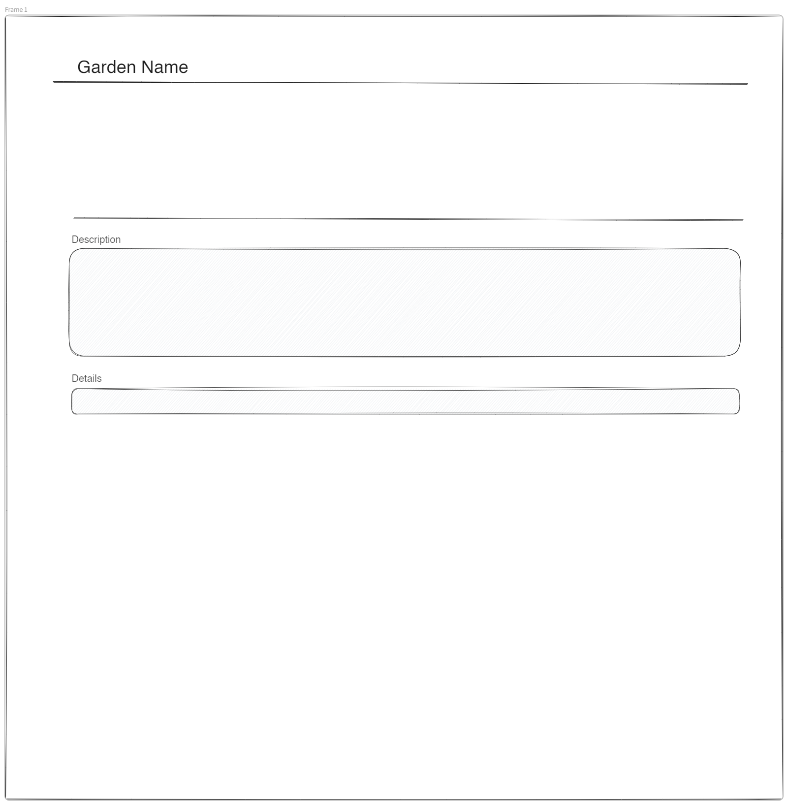

# Garden - Wireframes

The Garden wireframes allow:

- Viewing all the gardens a user has access to.
- Viewing all the pending invites.
- Creating a new garden
- Editing garden attributes
- Viewing the dashboard, members, chat, and metrics.

# App Base Context

These frames exist outside of the context of a specific garden.

## Gardens

This view is shown only to authenticated users, and it shows all the gardens they are members of, the memberships they have been invited too, the button to get to the creation form, and the button to get to the discover page

## Discover

This view is shown to anonymous and authenticated viewers, and allows searching public gardens.

## Create

# App Garden Context

These frames exist within the context of a specific garden.

## Context

An extra nav-style bar at the bottom of the screen gives context as to the current garden. It will show connection status and a dropdown displaying the currently connected/active users.

## Dashboard

This is the root page of a Garden. It should provide summary information about the state of the Planner, Devices, any new members, etc. I'm still not sure exactly what should go on it.

## Edit

Edit the Garden's attributes, eg. change the name.

## Members

View all the members, their roles, how long they've been in the garden. For admins, allow changing others' roles removing memberships.

## Metrics

