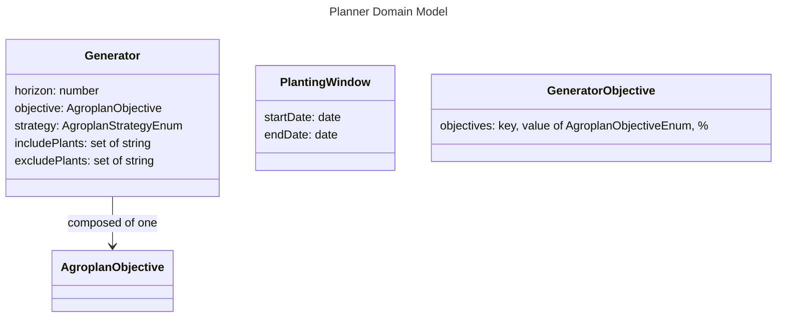

# Planner Models

Note: the models in this file aren't database models like the rest, as they have no reason to be persisted.

# PlantingWindow

A PlantingWindow just defines a window of time which a Cultivar may be planted within a specific Environment. In the Verdagraph, it is used to visualize calendar ranges when planting different plant species.

# Generator

Instead of constructing the model state entirely manually, it may be desirable to start from a populated state, especially for those who have no experience gardening. The idea of Generators is to populate the model with groups of Plants with the goal of optimizing the outcome of the space.

# horizon

The number of days from the current date the Generator will try to place Plants in.

## strategy

The strategy is the computational process used to populate the model. Extensive research has not been done on this, but one algorithm seems promising.

- Simulated annealing: this algorith uses random processes and entropy to converge on local maxima, and it is a quasi-optimization process.

## objective

There are several different objectives for a garden space which may be included. Given a model state, methods will be developed to calculate the level of satisfaction of different objectives. For example, by estimating the number of expected harvests, and the expected calories per harvest, a total expected calories can be derived from the Plants which are currently in the model.

The GeneratorObjective may take a weighted average of these metrics to produce a compound objective. The options are listed below.

### PlantPercentages

A simple way of evaluating a space is the proportion of different plants which make it up. For example, we can specify the goal is to have 15% of space taken up by tomatoes, 20% by lettuce, etc.

### Calories

Another simple way of evaluating a space is the total number of calories expected to be achieved.

### NutrientProfile

Given a total expected harvest, a nutrient profile based on the nutrient profile of each Cultivar involved could be calculated.

### Biodiversity

The number of distinct species could be used to calculate diversity.

### PollinatiorStrength

A bulk metric for how habitable a species of plant is to pollinators could be used to calculate the overall habitability of a space for pollinators.

### MinimalLabour

Given a qualitative labour metric for each plant species, plants could be chosen to minimize the labour required.
