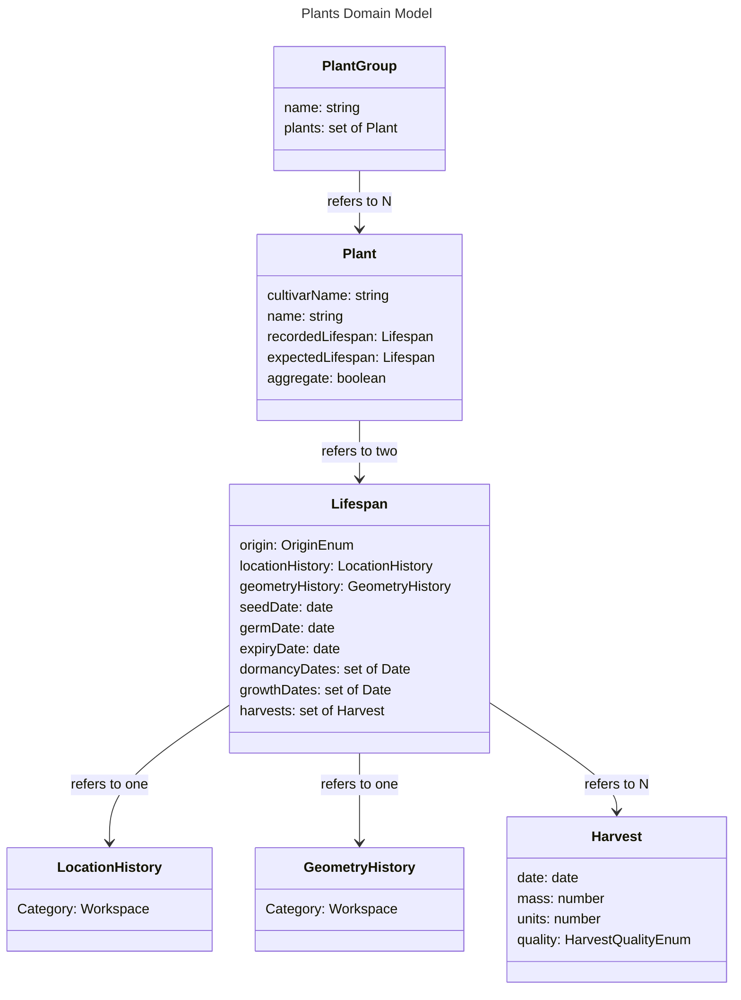

# Plants - Models

# Lifespan

The lifespan stores all data about a plant which may differ from expected to real behaviour.

## origin

The origin stores how the plant was created. Options are:

- directSeed: A seed is sown directly into the area it will reach maturity in.
- seedToTransplant: A seed is sown in one area and then transplanted into the area it will reach maturity in.
- seedlingToTransplant: A seedling is transplanted directly into the area it will reach maturity in.

In direct seed mode, most plants will have one location: the one they were seeded in. In seed to transplant mode, a plant will have at least two locations: the one where it was seeded, usually in a dedicated seed starting area, and where it is transplanted. Both should be defined when the plant is created. In the seedling to transplant mode, the plant starts as a seedling, for example, when seedlings are sourced from a nursery.

## locationHistory and geometryHistory

Both location and geometry may vary over time, as plants move around or grow.

## seedDate, germDate, expiryDate, dormancyDates, growthDates

Stores the key dates for the plants.

- seedDate: The date at which the plant is seeded.
- germDate: The date at which the seed germinated.
- expiryDate: The date at which the plant is removed from the space.
- dormancyDates: This is defined only for biennial or perennial plants. A set of dates which the plant became dormant until the following year. For example, includes the dates a berry bush has stopped producing fruit and vegetation.
- growthDates: This is defined only for biennial or perennial plants. A set of dates which the plant exited dormancy for the year. For example, includes the dates a berry bush has begun vegetative growth again.

## harvests

A variable number of harvests may be assigned to a plant. For plants which have a zero `AnnualLifecycleProfile.firstToLastHarvest` this should include only one harvest, but this may be overridden. Each harvest contains the following attributes:

- date: The date of the harvest.
- mass: The mass of the harvest, in kg.
- quality: The quality of the harvest. May be defective, passable, average, or exceptional
- units: The number of units. This may differ in meaning depending on the plant. For example, for carrots, it could mean the number of roots. For lettuce, it could mean the number of leaves.

# Plant

A plant represents a physical instance of a plant, or, if that level of granularity is not desired, a group of plants. The purpose of Plant models is:

1. To represent the spatial and temporal extent of plants during the planning phase, so that the can be planned around each other. For example, the more accurate of a model we have of how long a plant is going to last in a particular environment, the better we can plan to replace it with another, maximizing usage of space.
2. To represent the status of a plant in-real-life, for the purposes of tracking its progress, shifting the plan around this progress, and managing Actions associated with cultivating it.

## cultivarName

The plant model may store the name associated with a Cultivar, correlating with the `name` attribute in the Cultivar model. This is preferred to storing a direct reference to a Cultivar entity, as this allows flexibility in changing the CultivarCollection of a Garden without messing with the Plant model instances. When the attributes of a Cultivar are required, the name set on the Plant is used to search through the CultivarCollections set on the Garden.

## recordedLifespan and expectedLifespan

The purpose of storing two Lifespan objects is to clearly delineate between the attributes in the Plant model which have been planned with the software, and those which have been recorded from real life. When a Plant is created, its expectedLifespan is populated based on its Cultivar and any user-provided settings, while its recordedLifespan is empty. In this state, the plant is considered 'uncomitted' and is only a model-instance. Once the user records data about the plant, for example to say that this plant has germinated or been harvested, the recordedLifespan is populated and the plant instance becomes tied to a real entity.

## aggregate

If true, the model represents several different plants in real life. In this mode, less attention is paid to, for example, how geometry changes over time as plants grow, because the same model represents multiple plants. Instead of tracking individual carrots, we can use one model instance to track a square foot of space which has carrots in it, all planted at the same time.

# PlantGroup

PlantGroups are simple collections of references to Plants which serve to group them together. This is optional, but can be useful when experimenting with different plans. For example, all plants currently in the model which are uncomitted may be put together in a group, and then hidden, with a new group constructed in its place. This allows for creating multiple mutually-exclusive parallel plans for comparison, to try out new ideas without deleting old ones.
