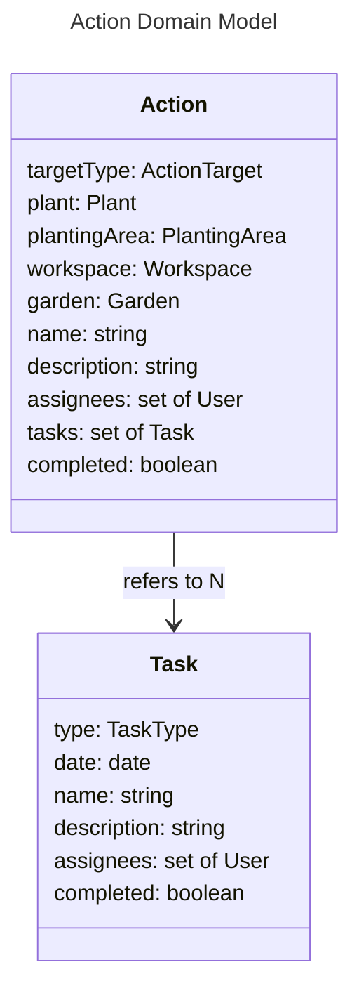

# Actions - Models

# Action

An Action represents a task or set of tasks which needs to be completed to bring the real world in line with the model. Actions will be automatically maintained by the software. For example, when adding a Plant, a number of Actions will be added correlating to the tasks which need to be done for this plant. If the plant is modified, these updates will be propogated to its related Actions. Actions may also be created manually.

## targetType, plant, plantingArea, workspace, garden

An Action may be tied to another entity. The options are:
- Plant
- PlantingArea
- Workspace
- Other

If `targetType` is `other`, the `plant`, `plantingArea`, and `workspace`, attributes will be undefined. Otherwise, they will be defined based on the value of `targetType`.

## assignees

A set of Users may be assigned to be responsible for completing a task.

## tasks

An Action is made up of multiple Tasks, which each describe an individual task. For example, a Plant might have one Action which contains Tasks for planting it, transplanting it, harvesting it, etc.

# Task

## type

Each Task has a type. These types are what the software uses to automatically populate task descriptions for each plant. The type options are:
- Seed a plant
- Thin around a plant
- Harden a plant
- Transplant a plant
- Harvest a plant
- Expire a plant
- Prune a plant
- Cover a planting area
- Weed a planting area
- Till a planting area
- Tidy a workspace
- Apply fertilizer
- Apply water
- Custom

## assignees

Allows specifying further assignees for each specific task.