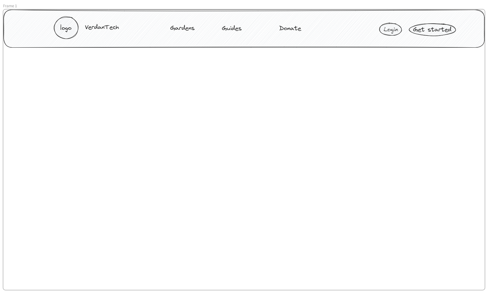
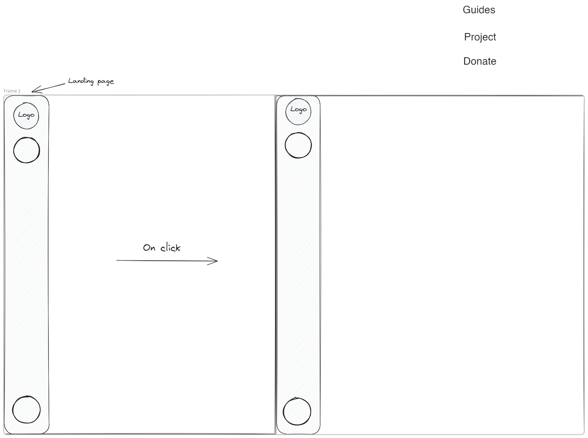
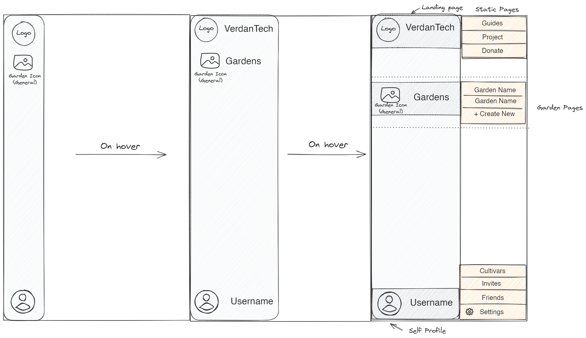
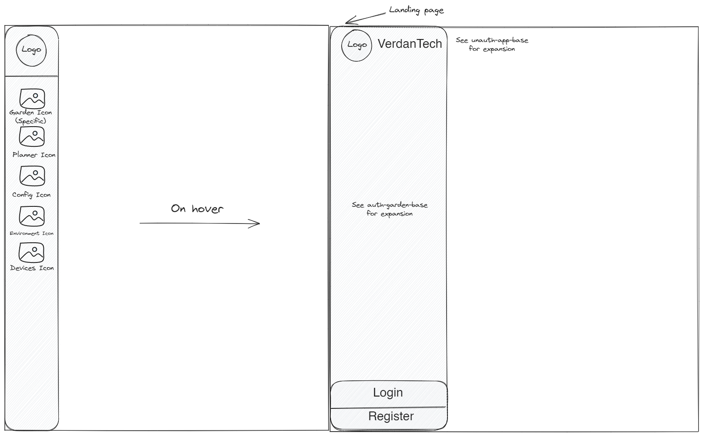
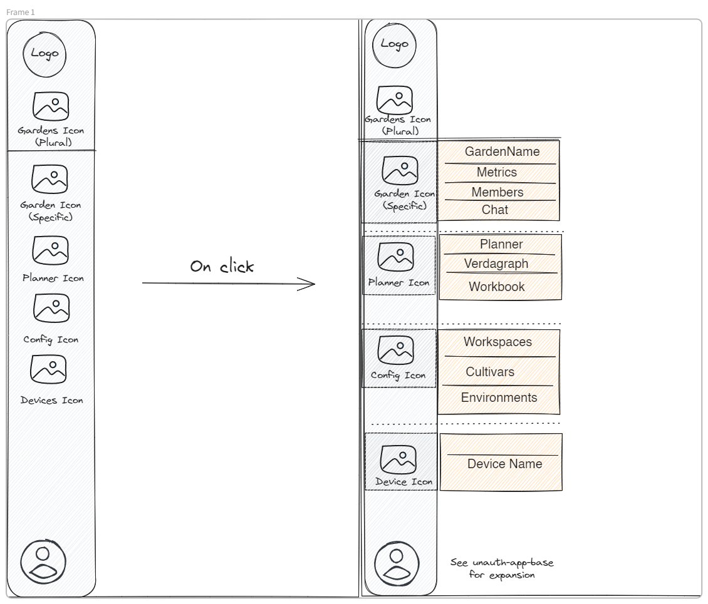

# App Shell - Wireframes

The App Shell is able to adapt to the following states:

1. Whether the user is anonymous or authenticated.
2. Whether the user is viewing static pages, app pages, or app pages within the context of a Garden.

# Static Pages

The [static pages](../static-pages/README.md) are the entry points to the website, including landing page, project page, and donation page.

## Anon Static Pages

A horizontal, top navbar is used for a familiar website-style introduction to the application.

## Auth Static Pages

The authenticated view of static pages should be the same at the [Auth App Base](#auth-app-base).

# App Base

The App Base applies to any non-static page that isn't within a garden context.

## Anon App Base

The anonymous view of the app should be basically the same as the anonymous view of the static pages, but match the sidebar configuration of the other cases.

## Auth App Base

The authenticated view of the app should give access to the static pages, the main [Gardens](../gardens/README.md) menu, and the [User](../users/README.md) menu.

# App Garden

The App Base applies to any non-static page that is within a garden context.

## Anon App Garden

The anonymous view of a garden should allow access to all the information in that garden, including the dashboard, planner, config, and devices tab. It should still contain Login and Register buttons, as well as a way of getting back to the static pages.

## Auth App Garden

The authenticated view of a garden should allow access to all the information in that garden, as well as retaining the main [Garden](../gardens/README.md) menu, and the [User](../users/README.md) menu.
