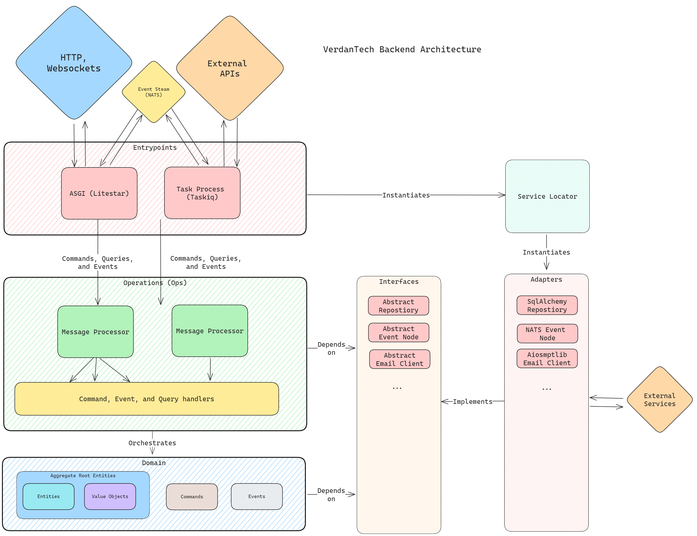

# Architecture and Design

The architecture of the backend is largely taken from the [Cosmic Python](https://github.com/cosmicpython/book) book, which is all about architecture patterns for managing complexity. The goal of the architecture is to have the core domain/business logic of the application be independent from all other implementation concerns and expressed as simply and transparently as possible. In theory, this minimizes the impedance between the semantics of the problem domain and the software, making it easier for the software to adapt to evolving ideas.

This pattern comes with the benefit of maintaining simple principles even as the software grows in complexity, such that features can continually be added and maintained without changing the overall structure. It comes at the cost of a higher complexity of design and repeated information, such as the need for seperate domain, persistence, and presentation models.

## Domain

The domain layer seeks to get as close as possible to the semantics of the domain as mapped and communicated by those with domain knowledge. To support this, it categorizes the logical modelling into *Entities*, *Value Objects*, *Aggregate Root Entities*, *Commands*, and *Events*.

The first three, *Entities*, *Value Objects*, *Aggregate Root Entities* are considered "models" as they represent a container for data and behaviour. The methods on these models are the core of the domain logic. Models are implemented using attrs.

*Commands*, and *Events* represent messages the system can respond to. 

### Entities

Entities are objects that are characterized by static unique identifiers rather than state. Identifiers are represented by UUIDs. Two entities are equivalent if their IDs are equal.

Entities can be persisted. The ID field is not generated until the first persistence, making it necessary to validate that entities are persisted during operations where this may not be the case.

Examples: Users, Gardens, Plants, etc.

### Value Objects

Value objects are objects that are characterize only by their state. Two value objects are equal if their values are equal. Value objects are immutable.

A value object that is not a member of an entity, by definition, is transient and cannot be persisted.

Examples: Emails, GardenMemberships, PlantingWindows, etc.

### Root Entities

Root entities are entities which define a transactional boundary with the database. This means that all domain logic is held self-consistent within aggregate roots. 

This is enforced by the convention of having one repository per root entity.

### Commands

Commands are inputs to the system which prompt it to change. 

They are implemented with Pydantic models which are used for the ease of implementing validation logic. Another benefit is that validation logic can be defined within the domain layer but the validation takes place at the edge of the system, when the ASGI process instantiated the object.

### Events

Events are internal messages that communicate that something has happened.

They are implemented with attrs.

## Application Operations (Ops)

The operations layer serves to orchestrate the domain layer, connect it with services, and provide an interface for the entrypoint layer to call, known as the MessageProcessor.

The operation handlers can be thought of as "use-cases" or individual workflows relevant to consumers of the app.

A typical ops workflow involves:
1. Locate all services, including a UnitOfWork.
2. Open the UnitOfWork context manager.
3. Validate any command against the UnitOfWork.
4. Fetch all required Root Entities.
5. Orchestrate the domain logic.
6. Commit the UnitOfWork.
7. Add any events.

When the calling process handles an incoming command, the command is executed and all events which occurred are either appended to the MessageProcessor's queue and executed as well, or they are sent to another process with an AbstractEventNode. This occurs until all events in the queue are complete.

### Commands

The commands section of the ops layer holds command handlers, which take a Command object, a service locator container, and an optional client user.

Command handlers do not return anything.

### Events

The events section of the ops layer holds event handlers, which take an Event object and a service locator container.

Event handlers do not return anything.

### Queries

The queries section of the ops layer holds Queries, QueryResults, and query handlers.

Queries are implemented with Pydantic models, similar to the Command objects in the domain.

QueryResults are implemented with attrs and cattrs. Cattrs generates mapping code between the domain model attrs classes and the QueryResult classes, enabling seamless casting. QueryResults may have a subset of the attributes of their associated domain model, and the type of sub-models in the QueryResult can be other QueryResults without problem.

Query handlers take a Query object, a service locator container, and an optional client user, and return a QueryResult.

## Interfaces

## Adapters

## Entrypoints
