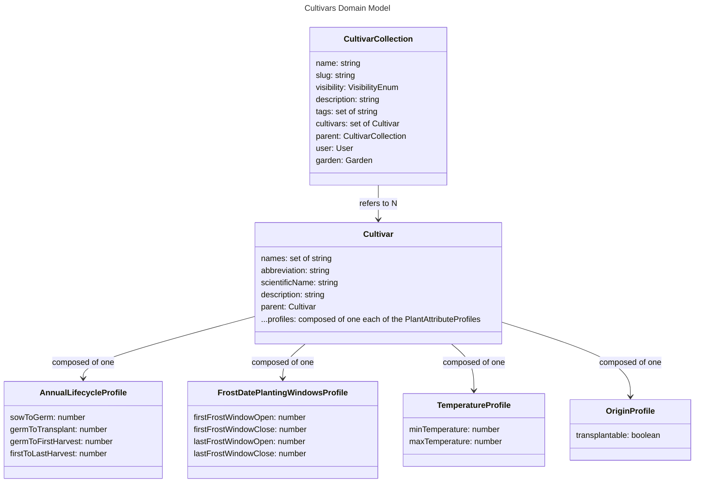

# Cultivars - Models

# Cultivar Collection

A cultivar collection groups together related Cultivars into a single package.

## visibility

If owned by a user, the HIDDEN setting will allow only that user to access the collection. If owned by a garden, the HIDDEN setting will allow only those with read-access to the garden access.

## tags

Optional metadata

## parent

A CultivarCollection may inherit its attributes from another collection. If it does so, it inherits all Cultivars from that collection, and may override or compose on top of this collection with its own Cultivars. If a collection that is referenced by another collection is deleted, the attributes of that collection are copied before deletion.

## user and garden

CultivarCollections are connected to either a user or a garden. If both user and garden are defined, the garden is the entity which owns the colletion.

# Cultivar

A cultivar is a container for attributes which describe a type of plant.

## names

The common names of the plant. For example: ["Zucchini", "Summer Squash", "Courgette"]

## abbreviation

A short, few character representation. Used for visual representation of plants when simple circular shapes are used. Example: "Le"

## parent

Similar to a CultivarCollection, a Cultivar can define a parent from which it inherits attributes from. The constraint is that this parent must be a Cultivar in the same CultivarCollection. This allows describing varieties of plants.

## profiles

The purpose of a Cultivar is to contain several different profiles which describe plant characteristics and how it interacts with the rest of the model. The idea with these profiles is that it should be easy to add more as the model grows more complex and more behaviour is required.

### Annual Lifecycle

The annual lifecycle defines the length of the stages of life for annual plants.

- seedToGerm: The expected amount of days from starting a seed to its germination.
- germToTransplant: The expected amount of days from the germination of a seed to when it will be ready for transplant. For cultivars which are not able to be transplanted, this value is unused.
- germToFirstHarvest: The expected amount of days the germination of a seed to when it will be ready for a harvest.
- firstToLastHarvest: The expected amount of days the first and last harvest of a plant. For plants which only have one harvest, this value is zero.

### Frost Date Planting Windows

A planting window defines a period of time within an environment that a cultivar should be planted. These attributes define an allowed planting window of time relative to the first and last frost dates. These planting windows are used for incdicating within the Verdagraph when plants are suggested to be planted.

- lastFrostWindowOpen: The amount of days between the last frost and the beginning of the planting window. Positive values indicate the window begins after the last frost date. For example, a value of -15 indicates the cultivar may be planted 15 days before the last frost date.
- lastFrostWindowClosed: The amount of days between the last frost and the end of the planting window. Positive values indicate the window begins after the last frost date. For example, a value of 15 indicates the cultivar must be planted before 15 days after the last frost date.
- firstFrostWindowOpen: The amount of days between the first frost and the beginning of the planting window. Positive values indicate the window begins after the first frost date. For example, a value of -15 indicates the cultivar may be planted 15 days before the first frost date.
- firstFrostWindowClosed: The amount of days between the first frost and the end of the planting window. Positive values indicate the window begins after the first frost date. For example, a value of 15 indicates the cultivar must be planted before 15 days after the first frost date.

### Origin

The origin refers to the method used to create plants.

- transplantable: Defines whether a plant may be started as a seed in one location and transplanted to another. Some plants, such as carrots, don't tolerate transplants, and so must be started directly.
