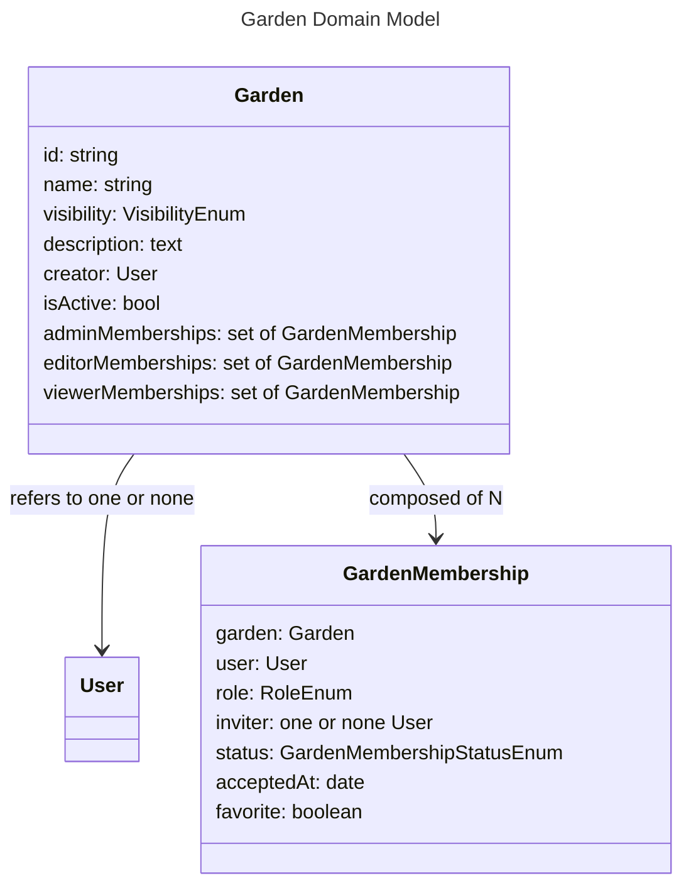

# Garden - Models

# Garden

A Garden is an container model that contextualizes most other models in the application. While a Workspace is a representation of a physical space, a Garden is an environment for multiple Workspaces and a permissions system for multiple Users.

## id

A unique but readable string id should be generated for each Garden, mostly for the purposes of URLs.

## name

A Garden's name should be non-unique and able to be changed at any time.

## creator

A Garden should keep track of the User that created it, but have no reliance on this references such that if the creator is deleted, the reference is set to None and nothing changes. This mean creators sill have an admin membership and are treated as an admin.

## visibility

A Garden should be able to have these levels of visibility:
- Hidden: View permissions and up are restricted to members.
- Unlisted: Edit permissions and up are restricted to members. Anyone with a link can view, but can't be found with a search.
- Public: Edit permissions and up are restricted to members. Anyone with a link can view, and potentially find on the site without a link.

## adminMemberships, editorMemberships, and viewerMemberships

Gardens should delete themselves after a set amount of time if they have no admins, editors, or viewers. If all Admins leave, the oldest Edit GardenMembership should be promoted to Admin.

# GardenMembership

GardenMembership models provide metadata for links between User and Garden models.

## garden

A GardenMembership should refer to only one Garden.

## user

A GardenMembership should refer to only one main User.

## inviter

A GardenMembership should keep track of who created it. If the inviter and the user are the same, the inviter should be None. The deletion of the inviter should be of no consequence to the GardenMembership. 

## role

A GardenMembership should be able to grant these levels of access:
- Admins:
    - Invite, demote, or revoke user memberships.
    - Change the garden attributes.
    - Add and remove Workspaces, CultivarSets.
    - Manipulate all model state.
- Edit:
    - Update most model state.
- View: 
    - Restricted to read-only.

## favorite

A garden membership should be able to be marked as a favorite, so it can show up at the top of the Gardens menu