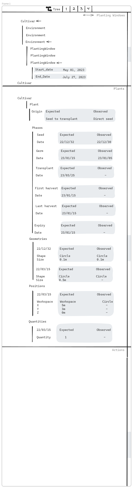
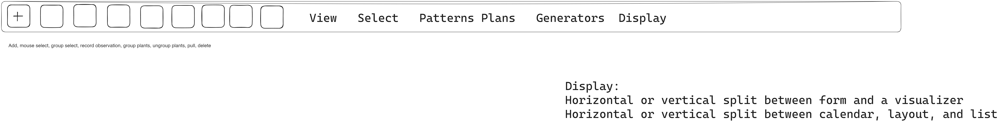

# Planner - Wireframes

The Planner pages are split into two groups:
- *Verdagraph*: a combination of three different views of the model state, mainly Plants, PlantingWindows, and Actions.
- *Workbook*: a list-like view of Actions optimized for assigning Actions among Users and using as a reference when carrying out tasks more conveninent than the Verdagraph.

# Verdagraph

The Verdagraph is split into three main views into the model state:
- *Tree*: Displays model attributes into a directory-like tree structure, with the goal of simplicity and easy keyboard navigability.
- *Calendar*: Displays model attributes into a grid-like temporal view, where models are organized as rows, and days are organized as columns.
- *Layout*: Displays model attributes according to their spatial layout.

All three of these windows are toggleable. They are supported by the following additional UI elements:
- *Timeline Selector*: Allows selecting a range of dates easily with the mouse and keyboard. This range dictates which model elements are visible in the Tree and Calendar, with the center of the range being the "selected day" which controls the day displayed in the Layout.
- *Toolbar*: A horizontal toolbar.
- *Form* A reusable component for storing a list of active forms (ex. "Add Plant", "Record Observation"), allowing the resuse of functionality between Tree, Calendar, and Layout.

## Tree

Using the [Tree](https://melt-ui.com/docs/builders/tree) component from Melt UI, [Plants](), [PlantingWindows](), and [Actions]() are displayed in scrollable windows.

The range of objects displayed is controlled by the [TimelineSelector](), with the selected day being highlighted.

Buttons:
1. PlantingWindow window toggle button
2. Plants window toggle button
3. Actions window toggle button
4. Sorting menu. The options for sorting are intended to adapt to whatever different use cases emerge. These are the options so far:

| PlantingWindows | Plants | Actions |
| -------- | ------- | ------- |
| Cultivar>Environment>PlantingWindow | Cultivar>Plant | ActionType |

## Calendar

## Layout

## Toolbar

## Form

## Timeline Selector

# Workbook
