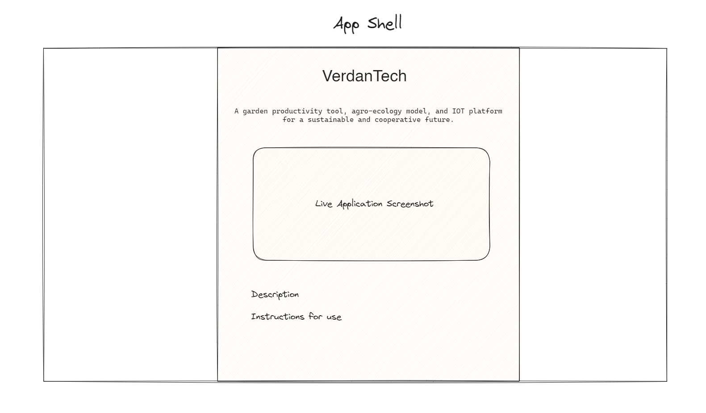

# Static Pages Wireframes

# Landing Page

The landing page should include:

- Key information about what the app does, and why
- Application screenshots (to be decided exactly what)
- Potentially a live demo

# Guides

[!Guides Wireframe](./wireframes/guides.excalidraw.png)

The guides will contain all user-focused documentation for using the app. The wireframes should lay out the general structure of the pages, but the content doesn't need to be included here, as it must heavily mirror the implementation at the time.

# Donation

The donation page will just contain a link to the liberapay, maybe some information about the financials of the project.

# Other

Brainstorm: what else should be included in the static pages?

- Information about planned features, roadmap, etc.
- Link to a YouTube video explaining the app.
- Link to the Discord, Github
