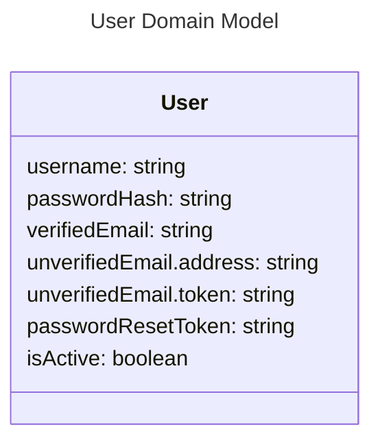

# User - Models

# Attribtutes

## username

The username should be the main identifier between users in the application. Usernames should be unique, case insensitive, and able to be changed at any time. Usernames should be validated to ensure no offensive or unsafe names are allowed (not currently done).

## passwordHash

The password must be encrypted. A password reset should be available through email verification.

## verifiedEmail, unverifiedEmail

The verifiedEmail stores the user's email which has been verified, or if verification is disabled. Emails may be verified by default if verification is disabled. The unverifiedEmail contains a JWT token which is used to confirm it through normal email verification means. The user may change their email, during wihch time the verifiedEmail attribute remains the same while the unverifiedEmail attribute is updated.

## passwordResetToken

Similar to emails, users can reset their passwords using this JWT token.