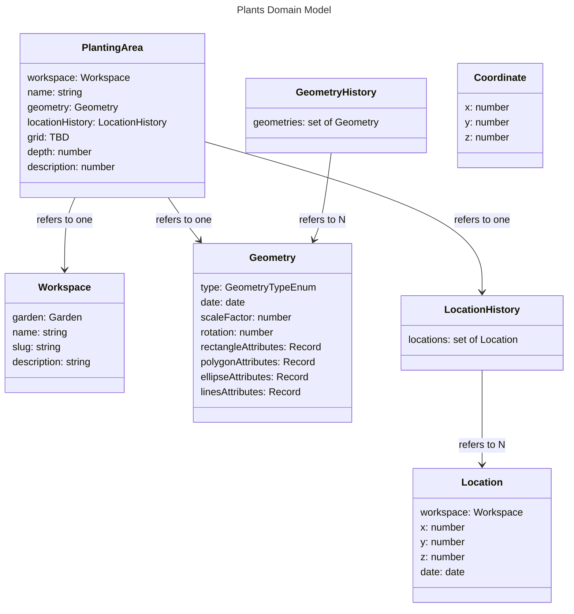

# Garden - Models

# Workspace

Workspaces are spatial containers for other model state. This allows partitioning the activity within a Garden to different spatial contexts. A Garden can have multiple workspaces.

## name

Should be unique within the garden.

## slug

Generated from the name.

# PlantingArea

A PlantingArea maps onto the real-world areas that plants are placed, eg., a garden bed, a pot, or just a tilled section of earth used for placing plants. Plants aren't necessarily restricted to PlantingAreas, but by default the user won't be allowed to place them there unless they explicitly allow it.

## geometry

A PlantingArea is defined by one geometry which should not change.

## locationHistory

A PlantingArea may move around, and so is described by multiple locations.

## grid

When adding plants to the Layout/Canvas, snapping to grid is an option. This allows users to follow a particular gardening pattern, for example square foot gardening where each PlantingArea is divided into square-foot sections. The Canvas has a background grid, but depending on the sizes and locations of the PlantingAreas, they may not align to this grid. So, each PlantingArea may define its own grid which allows snapping plant locations into place.

TODO: Better define the attributes of the grid, or if it is even necessary. When beginning the implementation of this, it was discovered that it wouldn't be able to be supported in the way originally intended for some geometries, because the origin method involved defining a number of rows and number of columns for the grid, which works well in rectangular geometries, but requires finding a bounding rectangle for polygons, ellipses, and lines geometries. This may be possible, but would be especially difficult in the lines geometries cases. Given this, the most straightforward solution is to continue with this approach and just not support lines geometries. However, alternatives should also be explored, such as not including grids into the data model and instead defining it on the client ad-hoc.

# Geometry and GeometryHistory,

The Geometry model is meant to describe a shape in 2D space. The GeometryHistory model includes a set of Geometries, allowing entities to change their shapes over time.

## type and attributes

Four types of geometries are supported: rectangles, polygons, ellipses, and lines. They are described by the following attributes.

RectangleAttributes:
- Length
- Width

PolygonAttributes:
- Number of sides
- Radius

EllipseAttributes:
- Horizontal diameter
- Vertical diameter

Lines:
- A set of Coordinates, located relative to the center of the shape.
- Whether the attributes describe a closed shape or not.

## scaleFactor

This allows scaling up the same geometry over time, for example to describe plant growth, while preserving the same proportions.

# Location and LocationHistory

The Location model describes a position within a particular workspace. A LocationHistory includes a set of locations, meaning entities can move between workspaces.

# Coordinate

The Coordinate model describes a position without reference to a workspace. It is used in the LinesAttributes to define an array of points.