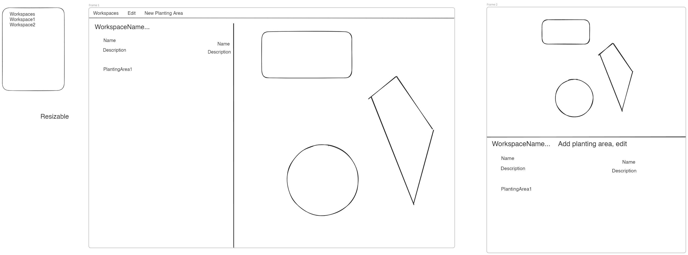

# Workspaces - Wireframes

The Workspace wireframes allow:

- Viewing all the workspaces in a garden
- Creating a new workspace
- Editing a workspace, including adding/updating PlantingAreas, using two views: the Tree and Layout

## Viewing workspaces

## Creating workspaces

## Viewing/Editing a workspace

